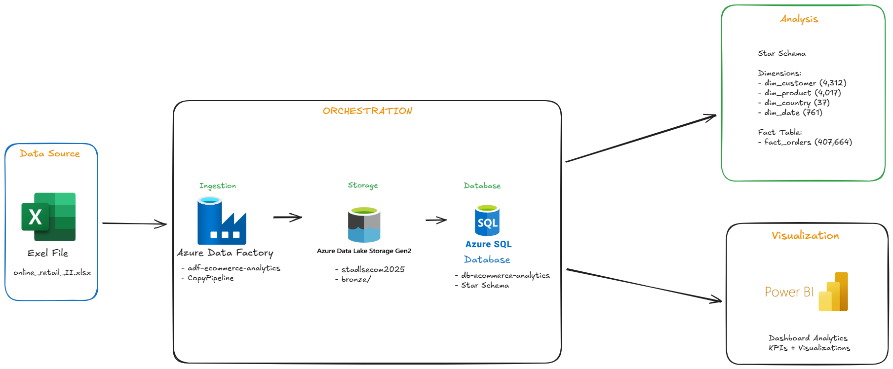

# 🛒 Azure E-commerce Analytics Pipeline


> Pipeline de données e-commerce end-to-end sur Azure - De l'extraction à la visualisation

## 📋 Table des matières
- [Vue d'ensemble](#-vue-densemble)
- [Architecture](#-architecture)
- [Technologies utilisées](#-technologies-utilisées)
- [Modèle de données](#-modèle-de-données)
- [Installation](#-installation)
- [Résultats](#-résultats)
- [Compétences démontrées](#-compétences-démontrées)

## 🎯 Vue d'ensemble

Ce projet présente une pipeline de données complète déployée sur Microsoft Azure pour analyser **407,664 transactions e-commerce**. Il démontre la mise en œuvre d'une architecture moderne de data engineering avec orchestration cloud, modélisation en étoile, et visualisation interactive.

### Contexte Business
Analyse des ventes d'un e-commerce retail britannique avec :
- **4,312 clients** actifs
- **4,017 produits** différents
- **37 pays** de livraison
- Période : Décembre 2009 - Décembre 2011

### Objectifs du projet
1. Construire une infrastructure data moderne sur Azure
2. Implémenter un processus ETL automatisé
3. Créer un data warehouse optimisé pour l'analyse
4. Développer des dashboards Power BI interactifs

## 🏗️ Architecture



### Pipeline de données

```
📄 Source (Excel)
    ↓
🗄️ Azure Data Lake Storage Gen2
    ├─ raw/     (données brutes)
    └─ bronze/  (données nettoyées)
    ↓
🔄 Azure Data Factory
    ├─ Orchestration ETL
    └─ Pipelines automatisés
    ↓
🗃️ Azure SQL Database
    └─ Star Schema
         ├─ dim_customer (4,312)
         ├─ dim_product (4,017)
         ├─ dim_country (37)
         ├─ dim_date (761)
         └─ fact_orders (407,664)
    ↓
📊 Power BI Desktop
    └─ Dashboards & KPIs
```

### Flux de traitement

1. **Ingestion** : Upload du fichier Excel vers ADLS Gen2 (container `raw/`)
2. **Nettoyage** : Transformation Python (suppression valeurs nulles, validation données)
3. **Stockage** : Sauvegarde des données nettoyées (container `bronze/`)
4. **Orchestration** : Pipeline Azure Data Factory pour charger vers SQL
5. **Transformation** : Création du Star Schema avec dimensions et table de faits
6. **Visualisation** : Connexion Power BI pour dashboards analytiques

## 🛠️ Technologies utilisées

### Cloud & Infrastructure
- **Azure Data Lake Storage Gen2** : Stockage des données brutes et transformées
- **Azure SQL Database** : Data warehouse relationnel
- **Azure Data Factory** : Orchestration ETL

### Langages & Frameworks
- **Python 3.11** : Scripts de nettoyage et transformation
  - pandas : Manipulation de données
  - pyodbc : Connectivité SQL
  - python-dotenv : Gestion de configuration
- **T-SQL** : Création du schéma et transformations

### Outils de visualisation
- **Power BI Desktop** : Dashboards et rapports interactifs

### DevOps
- **Git/GitHub** : Contrôle de version
- **VS Code** : Environnement de développement

## 📊 Modèle de données

### Star Schema

Le modèle suit une architecture **Star Schema** optimisée pour les requêtes analytiques :

#### Tables de dimensions
```sql
dim_customer
├─ customer_id (PK)
├─ country_id (FK)
└─ first_purchase_date

dim_product
├─ product_id (PK)
├─ stock_code
├─ description
└─ unit_price

dim_country
├─ country_id (PK)
└─ country_name

dim_date
├─ date_id (PK)
├─ full_date
├─ year
├─ month
├─ day
└─ day_of_week
```

#### Table de faits
```sql
fact_orders
├─ order_id (PK)
├─ invoice_no
├─ customer_id (FK)
├─ product_id (FK)
├─ country_id (FK)
├─ date_id (FK)
├─ quantity
├─ unit_price
└─ total_amount
```

### Relations
- **fact_orders** → **dim_customer** (N:1)
- **fact_orders** → **dim_product** (N:1)
- **fact_orders** → **dim_country** (N:1)
- **fact_orders** → **dim_date** (N:1)

## 🚀 Installation

### Prérequis
- Compte Azure avec crédits actifs
- Python 3.11+
- Azure CLI installé
- Power BI Desktop (pour la visualisation)

### Configuration Azure

1. **Créer les ressources Azure**
```bash
# Créer le resource group
az group create --name rg-ecommerce-analytics --location francecentral

# Créer le Storage Account (ADLS Gen2)
az storage account create \
  --name stadlsecom2025 \
  --resource-group rg-ecommerce-analytics \
  --location francecentral \
  --sku Standard_LRS \
  --kind StorageV2 \
  --hierarchical-namespace true

# Créer les containers
az storage container create --name raw --account-name stadlsecom2025
az storage container create --name bronze --account-name stadlsecom2025

# Créer Azure SQL Database
az sql server create \
  --name sql-ecommerce-analytics-2025 \
  --resource-group rg-ecommerce-analytics \
  --location francecentral \
  --admin-user sqladmin \
  --admin-password <YOUR_PASSWORD>

az sql db create \
  --resource-group rg-ecommerce-analytics \
  --server sql-ecommerce-analytics-2025 \
  --name db-ecommerce-analytics \
  --service-objective Basic
```

2. **Configurer Azure Data Factory**
   - Créer une instance ADF via le portail Azure
   - Configurer les Linked Services pour ADLS Gen2 et SQL Database
   - Créer le pipeline de copie

### Configuration locale

1. **Cloner le repository**
```bash
git clone https://github.com/GodsonHOUNSONLON/azure-ecommerce-analytics.git
cd azure-ecommerce-analytics
```

2. **Installer les dépendances**
```bash
python -m venv .venv
source .venv/bin/activate  # Linux/Mac
# ou .venv\Scripts\activate  # Windows

pip install pandas pyodbc python-dotenv
```

3. **Configurer les variables d'environnement**
```bash
# Copier le template
cp .env.example .env

# Éditer .env avec vos credentials
AZURE_STORAGE_CONNECTION_STRING=your_connection_string
SQL_SERVER=sql-ecommerce-analytics-2025.database.windows.net
SQL_DATABASE=db-ecommerce-analytics
SQL_PASSWORD=your_password
```

### Exécution

1. **Nettoyer les données**
```bash
python clean_data.py
```

2. **Créer le schéma SQL**
```bash
# Dans Azure Data Studio ou SSMS
sqlcmd -S sql-ecommerce-analytics-2025.database.windows.net \
       -d db-ecommerce-analytics \
       -U sqladmin \
       -i create_schema.sql
```

3. **Charger les données**
```bash
python load_to_sql.py
python load_fact_orders.py
```

4. **Ouvrir Power BI**
   - Ouvrir Power BI Desktop
   - Se connecter à Azure SQL Database
   - Importer les tables
   - Créer les visualisations

## 📈 Résultats

### Métriques clés
- **Chiffre d'affaires total** : 8.83M £
- **Nombre de clients** : 4,312
- **Nombre de commandes** : 25,900
- **Panier moyen** : 341 £
- **Top pays** : Royaume-Uni (82% du CA)

### Dashboards Power BI
- **KPIs** : CA, clients actifs, nombre de commandes
- **Analyse géographique** : Carte des ventes par pays
- **Analyse produits** : Top 10 best-sellers
- **Tendances temporelles** : Évolution mensuelle des ventes
- **Répartition** : Distribution du CA par région

### Performance technique
- **Volume de données** : 407,664 transactions chargées
- **Temps d'exécution pipeline** : ~5 minutes
- **Coût mensuel Azure** : ~7€ (tier Basic)
- **Temps de réponse requêtes** : <100ms

## 💡 Compétences démontrées

### Data Engineering
- ✅ Design et implémentation de data warehouse (Star Schema)
- ✅ Pipeline ETL automatisé avec orchestration cloud
- ✅ Gestion de la qualité des données (nettoyage, validation)
- ✅ Optimisation des requêtes SQL

### Cloud Azure
- ✅ Architecture multi-services (ADLS Gen2, SQL DB, ADF)
- ✅ Gestion des ressources et coûts
- ✅ Sécurité (firewall, credentials management)
- ✅ Intégration de services cloud

### Développement
- ✅ Python pour data processing (pandas, pyodbc)
- ✅ SQL avancé (CTEs, window functions, jointures)
- ✅ Git/GitHub pour versioning
- ✅ Bonnes pratiques (.gitignore, .env, documentation)

### Business Intelligence
- ✅ Modélisation dimensionnelle
- ✅ Création de dashboards Power BI
- ✅ Analyse de KPIs business
- ✅ Visualisation de données

## 📝 Améliorations futures

- [ ] Automatisation complète avec Azure Functions
- [ ] Implémentation de la couche Silver (données agrégées)
- [ ] Ajout de tests unitaires
- [ ] Monitoring avec Azure Monitor
- [ ] CI/CD avec Azure DevOps
- [ ] Analyse prédictive (ML) pour forecasting des ventes

## 📞 Contact

**Godson HOUNSONLON**
- GitHub: [@GodsonHOUNSONLON](https://github.com/GodsonHOUNSONLON)
- LinkedIn: [Votre profil LinkedIn]
- Email: votre.email@example.com

## 📄 Licence

Ce projet est sous licence MIT. Voir le fichier `LICENSE` pour plus de détails.

---

⭐ Si ce projet vous a été utile, n'hésitez pas à lui donner une étoile !
